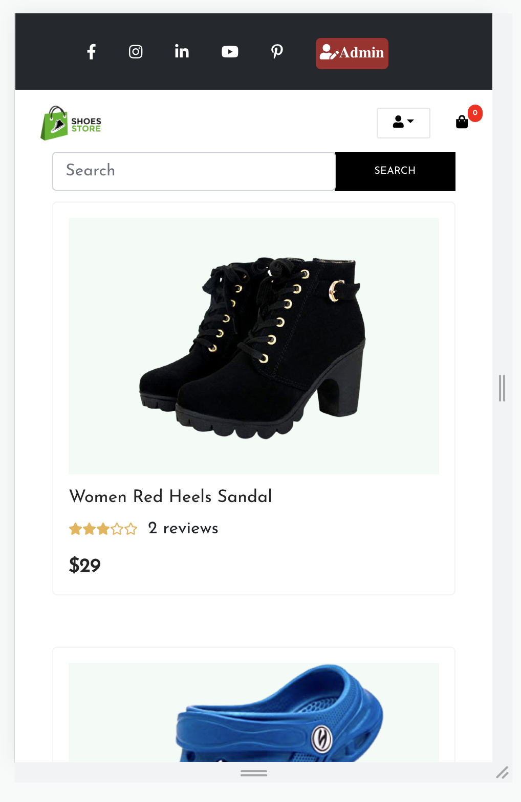

 # Ecommerce Reservation

### Content - :
  shoe-shop-app folder(in react js)
  shoe-shop-server folder (node, express, mongodb)

### npm start - :
Runs the app in the development mode.
Open http://localhost:3000 to view it in the browser.

The page will reload if you make edits.
You will also see any lint errors in the console.

### `Screen shot`
 
 
 
 
 
 
 
 
 
 
 
 
